# Bharat Bijli Corporation Utility Bill Pay Application

Welcome to the **Bharat Bijli Corporation (BBC)**, a unified platform designed to streamline utility bill payments and management.

- **Sushmita Bennisur** - Employee Portal
- **Niraj Surve** - Customer Portal

## Table of Contents

- [Description](#description)
- [Features](#features)
- [Installation Instructions](#installation-instructions)
- [Customer User Guide](#customer-user-guide-with-screenshots)
- [Employee User Guide](#employee-user-guide-with-screenshots)

## Description

The BBC Utility Bill Pay Application includes two main portals:

1. **Customer Portal (Utility Bill Pay App):** This portal enables customers to manage their utility bills, view invoices, make payments, and track their transaction history.
2. **Employee Portal (Operations Portal):** This portal is for BBC employees to manage customer accounts, generate invoices, and handle administrative tasks.

## Features

### Customer Portal (Utility Bill Pay App)

- **Dashboard:** View billing statistics and recent activities.
- **Invoices:** Access all your invoices, with notifications for unpaid bills.
- **Invoice Payment:** Pay outstanding invoices using a preferred payment method.
- **Transaction History:** Review all past transactions and payment statuses.

### Employee Portal (Operations Portal)

- **Dashboard:** Monitor key statistics and business metrics.
- **Customer Management:** Manage customer accounts and access their transaction history.
- **Bill Generation:** Generate utility bills for customers.

## Installation Instructions

Follow the steps below to set up the BBC Utility Bill Pay App locally:

### Prerequisites

- **Node.js** (v16 or higher)
- **Angular CLI** (v17 or higher)
- **Java 17** or higher
- **Maven** (for backend build)
- **MySQL**

### Backend Setup (Spring Boot with MySQL)

1. Clone the repository:
   ```bash
   git clone https://github.com/nirajs-finzly/bbc-portal.git

2. Navigate to backend folder:
   ```bash
   cd backend
   ```
3. Update `application.properties` with your configurations:

4. Run the spring boot project.

### Frontend Setup (Angular)

1. Clone the repository:
   ```bash
   git clone https://github.com/nirajs-finzly/bbc-portal.git
   ```
2. Install dependencies:
   ```bash
   cd frontend
   npm install
   ```
3. Start development server:
   ```bash
   npm start 
   ```
   or

   ```bash
   ng serve 
   ```
4. View the running app on:
   ```bash
   http://localhost:4200/
   ```

### Customer User Guide with Screenshots

#### Customer Portal

##### Login Page

- Enter the customer ID provided by the system. 
- Click the "Submit OTP" button to receive an OTP on your registered email.

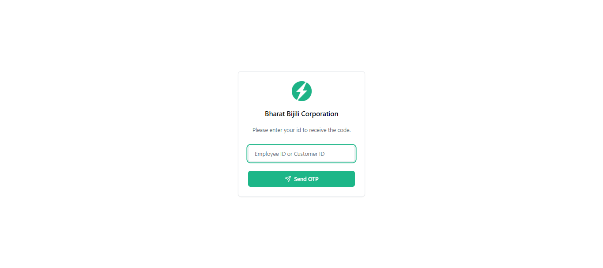

##### OTP Page

- Enter the OTP received on your email.
- Click "Login" to access your account.

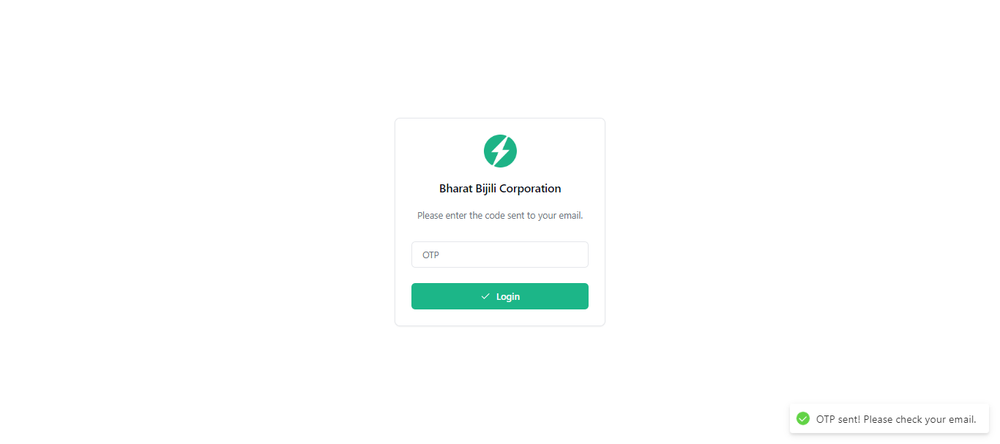

##### Dashboard

- View an overview of your utility account and billing statistics.

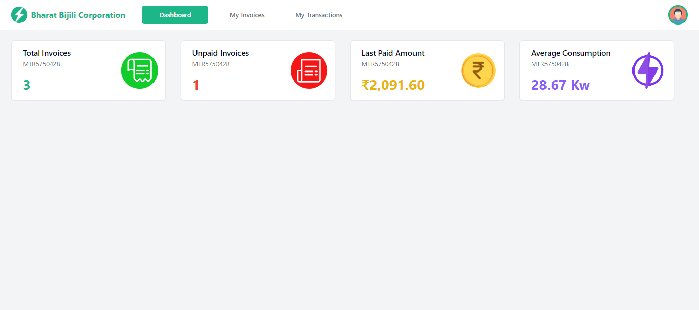

##### Invoices Page

- View all your invoices and pay any unpaid invoices by clicking "Pay Now."

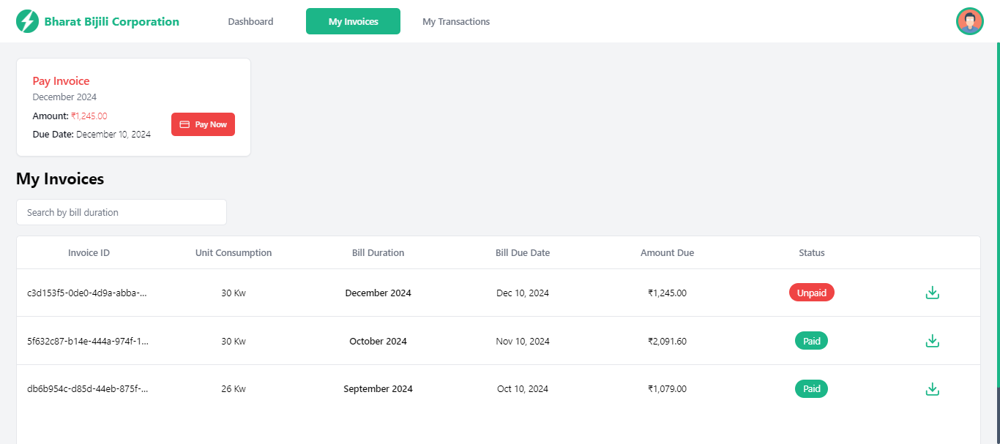

##### Invoice Payment Details

- After selecting "Pay Now," you'll be redirected to this page to view the invoice details before payment.

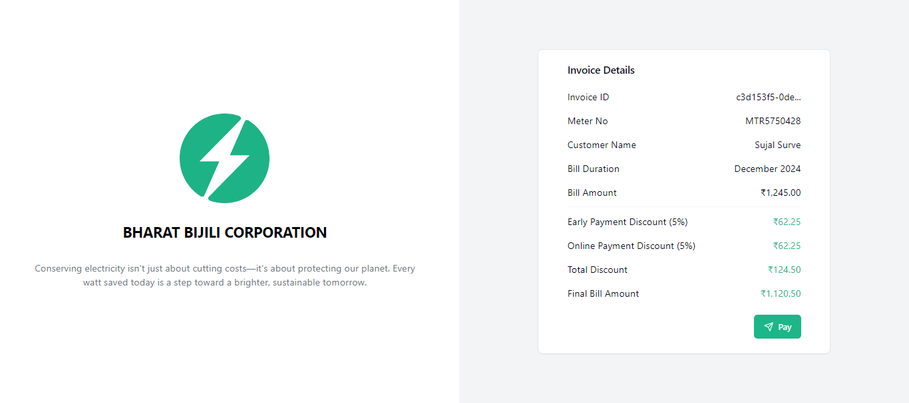

##### On next step user has to select the appropriate payment method
##### Select Payment Method (Pay with Card)

- Enter your credit or debit card details to complete the payment.

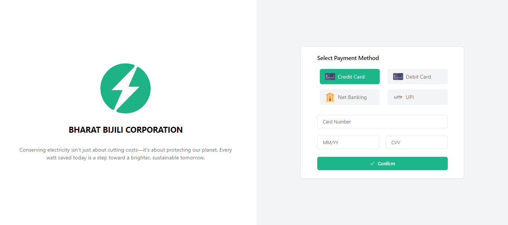


##### Select Payment Method (Pay with Net Banking)

- Enter your bank details for net banking payment.

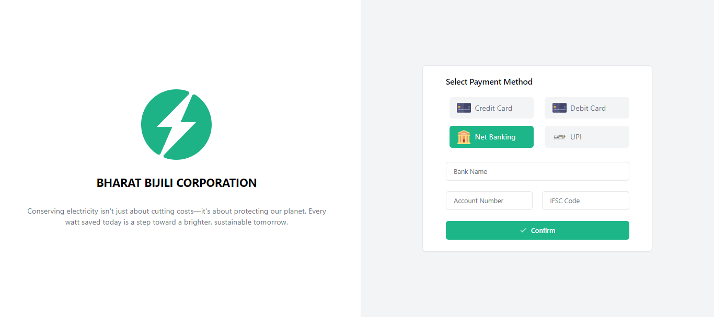

##### Select Payment Method (Pay with UPI)

- Enter your UPI ID to pay through UPI.


##### Confirm Payment with OTP

- Click "Confirm Payment" to receive an OTP for payment confirmation via email.
- Enter the OTP to complete the transaction.

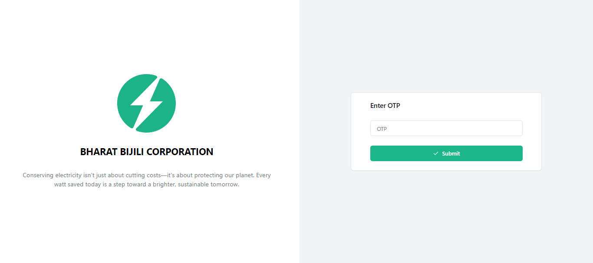

- After a successful payment, you will see a confirmation popup.

##### Payment Success Popup

- If the payment fails, you will see a failure notification.

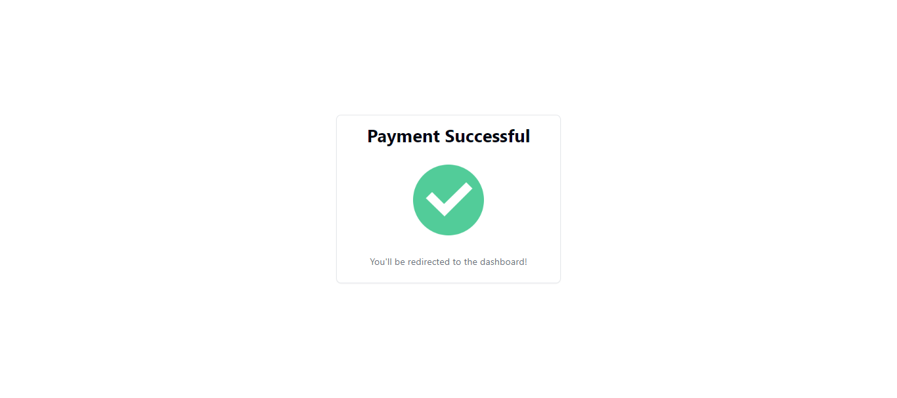

##### Payment Failure Popup

- If the payment is failed, then user will see a popup of failed payment.

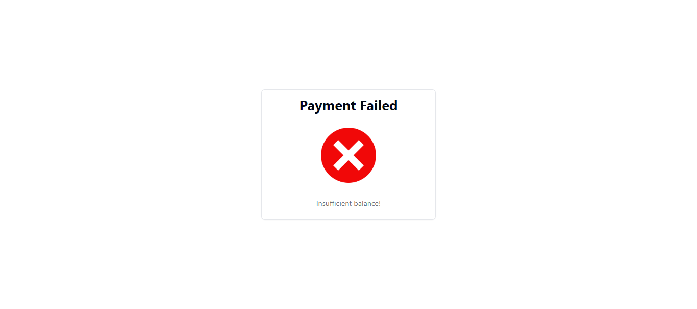

##### Customer Transactions

- View your transaction history, including successful and failed transactions.

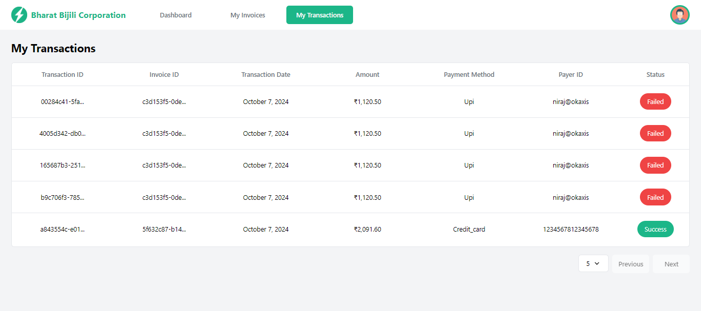


### Employee User Guide with Screenshots

#### Employee Portal

##### Login Page

- Enter the employee ID provided by the system. 
- Click the "Submit OTP" button to receive an OTP on your registered email.


##### OTP Page

- Enter the OTP received on your email.
- Click "Login" to access your account.


##### Dashboard

- View an overview of customer and invoice data statistics.

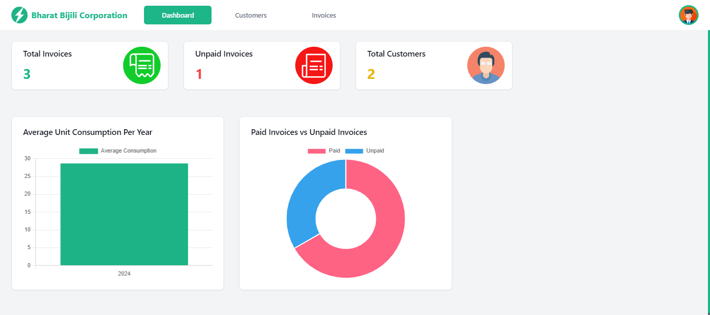

##### View All Customers 

- Access the "Customers" section to view a list of all registered customers.
- You can search for specific customers using the search bar or filter by various criteria.

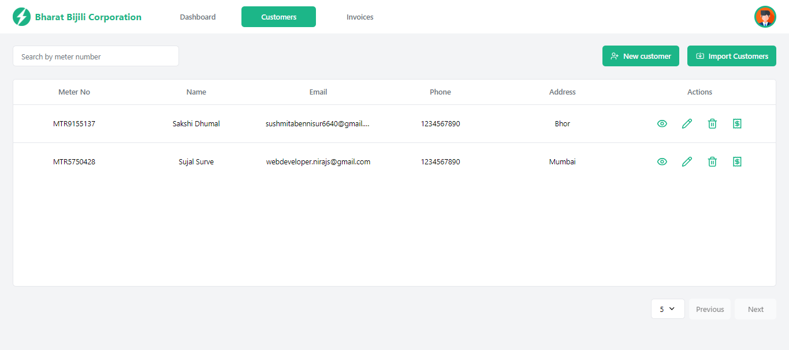

##### View Specific Customer Data

- Click on view customer from the list to view detailed information about customer.

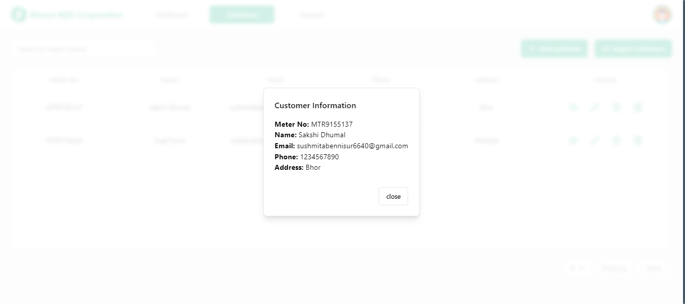

##### Edit Customer Data

- In the customer details page, click the "Edit" icon to update customer information such as name, address, or phone.

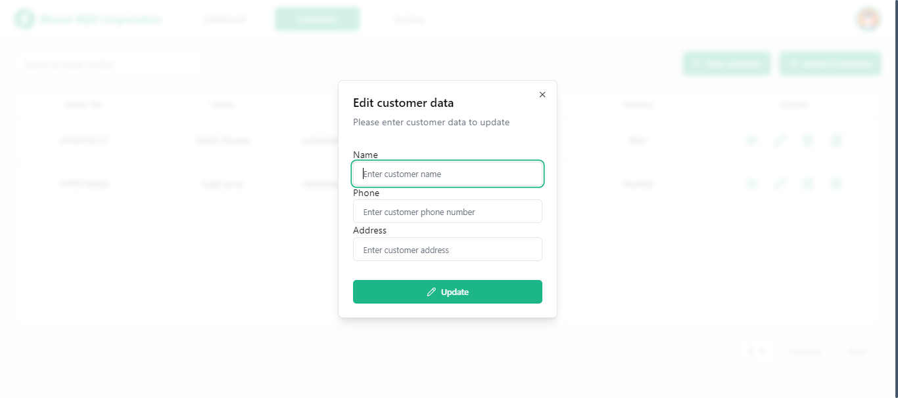


##### Delete Customer

- To delete a customer, click on "Delete" icon.
- Confirm the action in the popup prompt.

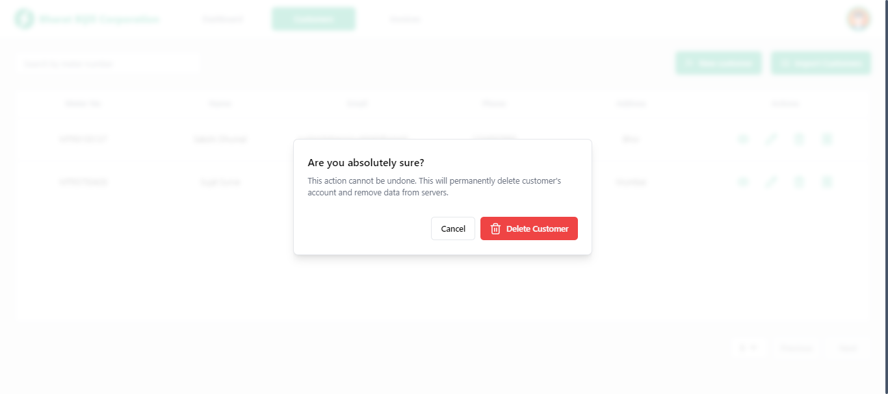

##### View Transactions of Customer

- In the customer details page, click on "Transactions" icon to view all transaction records.

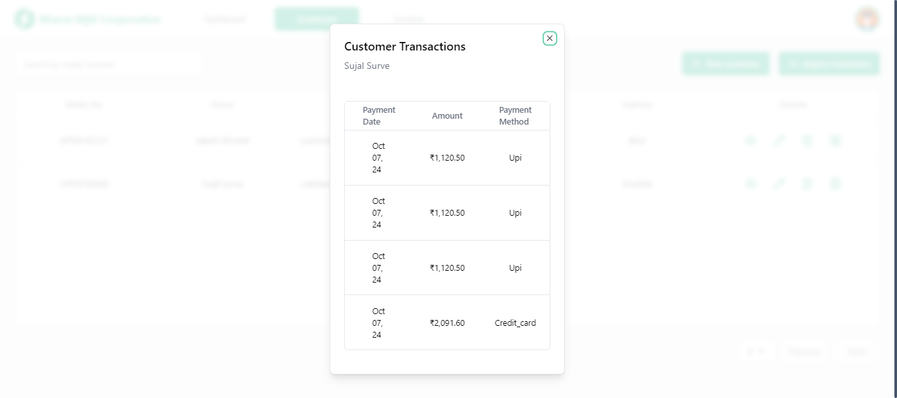

##### Create Customer

- To add a new customer, go to the "Customers" section and click "Create Customer."
- Fill in the required details and click "Submit."

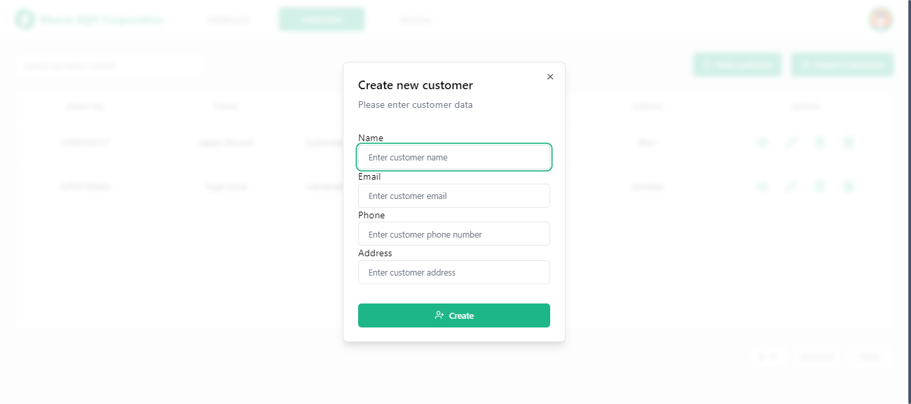

##### Bulk Upload Customers

- To upload customer data in bulk, click the "Bulk Upload" button in the "Customers" section.
- Upload a CSV file containing the required customer details and review the upload results.

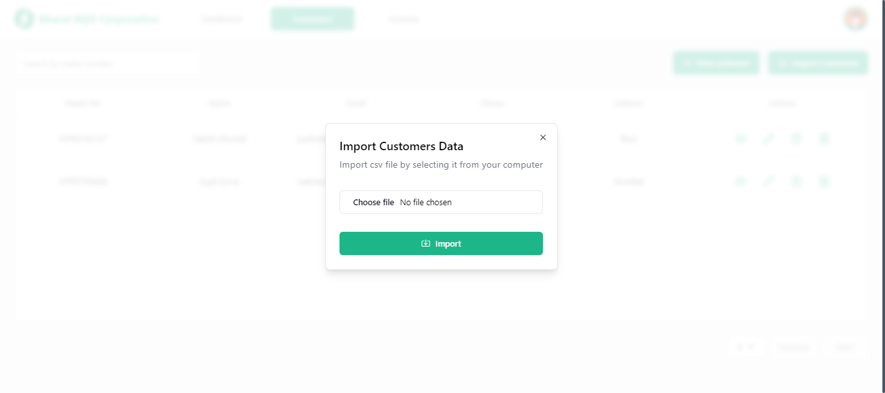

##### View All Invoices

- In the "Invoices" section, you can view all customer invoices.
- You can search for invoice by customer name using the search bar.

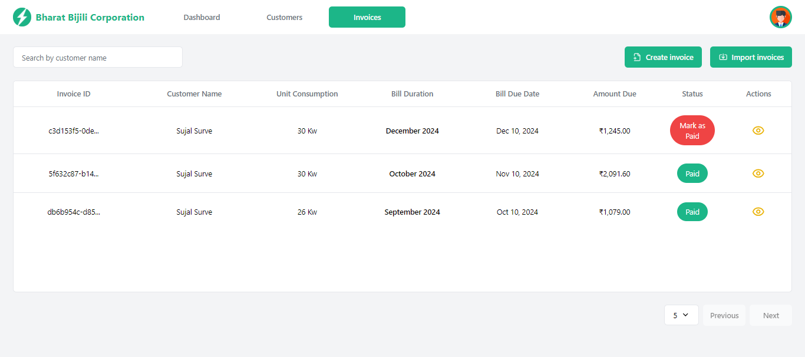

##### Create Invoice

- To create an invoice, navigate to the "Invoices" section from the dashboard.
- Click the "Create New Invoice" button and fill out the details and submit.


##### Bulk Upload Invoices

- To upload invoice data in bulk, click the "Bulk Upload" button in the "Invoices" section.
- Upload a CSV file containing the required invoice details and review the upload results.


##### Mark As Paid

- To manually mark an invoice as paid, go to the "Invoices" page and locate the unpaid invoice.
- If the payment was done offline (e.g., cash), click the "Mark as Paid" button next to the invoice.
- The invoice status will change to "PAID."


##### View Invoice PDF

- To view an invoice's details in PDF format, find the specific invoice and click the "View" icon.
- This will open the invoice in PDF format, where you can view or download it for records.


